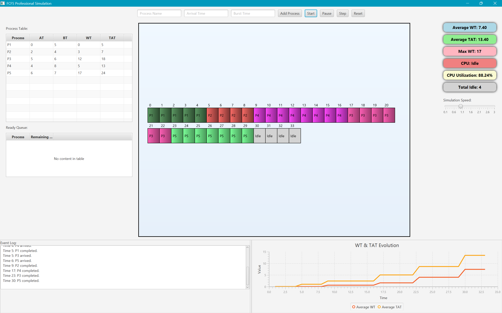

# FCFS Scheduler Simulator

A professional JavaFX-based visualization tool for simulating First-Come, First-Served (FCFS) CPU scheduling algorithms with real-time metrics and interactive Gantt chart display.

[](https://github.com/TSR0705/FCFS-SCHEDULING-SIMULATOR)
[](https://adoptium.net/)
[](https://maven.apache.org/)
[](https://openjfx.io/)

## 📖 Table of Contents

- [Overview](#-overview)
- [Key Features](#-key-features)
- [Demo](#-demo)
- [Installation & Setup](#️-installation--setup)
- [Usage Guide](#-usage-guide)
- [Technical Architecture](#-technical-architecture)
- [Project Structure](#-project-structure)
- [Contributing](#-contributing)
- [License](#-license)

## 🌟 Overview

This application provides an interactive simulation of the First-Come, First-Served (FCFS) CPU scheduling algorithm. FCFS is one of the simplest scheduling algorithms where processes are executed in the order they arrive in the ready queue. 

**Perfect for:**
- Students learning operating system concepts
- Educators teaching CPU scheduling algorithms
- Developers understanding process scheduling behavior
- Anyone visualizing how FCFS scheduling works in real-time

## 🚀 Key Features

### Core Functionality
- **Interactive Process Management**: Add custom processes with names, arrival times, and burst times
- **Real-time Simulation**: Step through manually or run automatically with adjustable speed (0.1x to 3x)
- **Dynamic Gantt Chart**: Color-coded visualization showing process execution and idle periods
- **Auto-expanding Canvas**: Automatically adjusts to accommodate long simulations

### Analytics & Metrics
- **Comprehensive Performance Metrics**:
  - Average Waiting Time (WT)
  - Average Turnaround Time (TAT)
  - Maximum Waiting Time
  - CPU Utilization percentage
  - Total Idle Time tracking
- **Performance Evolution Charts**: Line graphs showing how WT and TAT change over time
- **Process Tables**: View all processes and ready queue status at a glance

### User Experience
- **Detailed Event Logging**: Track process arrivals, executions, and completions
- **Interactive Tooltips**: Hover over Gantt blocks for detailed process information
- **Intuitive Controls**: Easy-to-use buttons for Start, Pause, Step, and Reset
- **Responsive UI**: 1300x850 pixel resizable window with organized layout

## 🎥 Demo

### Screenshots

<div align="center">
  <div style="display: flex; justify-content: space-around; flex-wrap: wrap; gap: 20px;">
    <div style="text-align: center; margin: 10px;">
      
      <p><strong>Simulator Dashboard</strong></p>
    </div>
    <div style="text-align: center; margin: 10px;">
      
      <p><strong>Simulation in Progress</strong></p>
    </div>
  </div>
</div>

### Video Walkthrough

<div align="center">
  <a href="https://youtu.be/Ppm3BWCN66A?si=EezB81bGeXrtdo_Q" target="_blank">
    
  </a>
  <p>
    <a href="https://youtu.be/Ppm3BWCN66A?si=EezB81bGeXrtdo_Q" target="_blank">
      <strong>Watch the full FCFS Scheduler demo on YouTube</strong>
    </a> 
    <em>(Duration: ~5 minutes)</em>
  </p>
</div>

## 🛠️ Installation & Setup

### Prerequisites

Ensure you have the following installed on your system:

| Requirement | Version | Download Link |
|------------|---------|---------------|
| Java Development Kit (JDK) | 21 or higher | [Adoptium](https://adoptium.net/) |
| Apache Maven | 3.6 or higher | [Maven](https://maven.apache.org/download.cgi) |
| Git | Latest | [Git](https://git-scm.com/downloads) |

### Installation Steps

1. **Clone the Repository**
   ```bash
   git clone https://github.com/TSR0705/FCFS-SCHEDULING-SIMULATOR.git
   cd FCFS-SCHEDULING-SIMULATOR
   ```

2. **Verify Prerequisites**
   ```bash
   java -version    # Should show Java 21 or higher
   mvn -version     # Should show Maven 3.6 or higher
   ```

3. **Build the Project**
   ```bash
   mvn clean compile
   ```

4. **Run the Application**
   ```bash
   mvn javafx:run
   ```

### Alternative Running Methods

**Method 1: Using Launcher Class**
```bash
mvn exec:java -Dexec.mainClass="com.example.fcfs_scheduler.Launcher"
```

**Method 2: Build and Run JAR**
```bash
mvn clean package
java -jar target/FCFS_Scheduler-1.0-SNAPSHOT.jar
```

### Troubleshooting Common Issues

| Issue | Solution |
|-------|----------|
| `JAVA_HOME not set` | Set JAVA_HOME environment variable to your JDK 21 installation path |
| `JavaFX modules not found` | Verify JavaFX dependencies in pom.xml are correctly configured |
| `Maven not found` | Ensure Maven is installed and its bin directory is added to your PATH |
| `Module error` | Check that module-info.java is present and correctly configured |

**Need more help?** [Open an issue](https://github.com/TSR0705/FCFS-SCHEDULING-SIMULATOR/issues) on GitHub.

## 📚 Usage Guide

### Quick Start Tutorial

**Step 1: Add Processes**
1. Enter a process name (e.g., "P1", "Process-A")
2. Enter arrival time in time units (leave blank for time 0)
3. Enter burst time (how long the process needs the CPU)
4. Click "Add Process"
5. Repeat to add more processes

**Example Process Set:**
- P1: Arrival=0, Burst=4
- P2: Arrival=1, Burst=3
- P3: Arrival=2, Burst=2

**Step 2: Run the Simulation**
- **Step Mode**: Click "Step" to advance one time unit at a time (recommended for learning)
- **Automatic Mode**: Click "Start" for continuous execution
- **Adjust Speed**: Use the speed slider (0.1x to 3x) during automatic execution
- **Pause**: Click "Pause" to temporarily stop automatic mode

**Step 3: Analyze Results**
- **Gantt Chart**: Observe process execution order and timing
- **Metrics Panel**: View real-time performance statistics
- **Process Tables**: Check individual process details and queue status
- **Event Log**: Review detailed execution timeline
- **Evolution Chart**: Analyze how metrics change over time

**Step 4: Reset and Experiment**
- Click "Reset" to clear everything and try different process configurations
- Experiment with different arrival times and burst times to see how FCFS behaves

### Understanding the Metrics

- **Waiting Time (WT)**: Time a process spends in the ready queue waiting for CPU
- **Turnaround Time (TAT)**: Total time from arrival to completion (WT + Burst Time)
- **CPU Utilization**: Percentage of time the CPU is actively executing processes
- **Idle Time**: Total time the CPU spends waiting for processes to arrive

### Tips for Best Results

- Start with 3-5 processes to understand the basics
- Try processes with same vs. different arrival times
- Observe how FCFS can lead to convoy effect (long processes blocking short ones)
- Use Step mode first to understand each time unit's behavior

## 🏗️ Technical Architecture

### Core Components

#### 1. Process Class
```java
static class Process {
    String name;
    int arrivalTime, burstTime;
    int remainingTime;
    int waitingTime, turnaroundTime, completionTime;
    Color color; // Randomly assigned for visualization
}
```

#### 2. Gantt Block Class
```java
static class GanttBlock {
    Process process; // null indicates CPU idle time
    double x, y, width, height;
    int cumulativeWT, cumulativeTAT, cumulativeCT;
}
```

#### 3. Scheduling Algorithm

The FCFS algorithm implementation follows these principles:

- **Queue Management**: Uses FIFO (First-In-First-Out) data structure
- **Process Selection**: Always executes the first process in the ready queue
- **Non-preemptive**: Once a process starts, it runs to completion
- **Metrics Calculation**: Real-time computation of WT, TAT, and utilization

**Algorithm Workflow:**
1. At each time unit, check for newly arrived processes
2. Add arriving processes to the ready queue
3. Execute the first process in the queue (if any)
4. Update process remaining time and metrics
5. Remove completed processes from the queue
6. Track idle time when queue is empty

#### 4. Visualization Engine

- **Canvas Rendering**: Dynamic Gantt chart with auto-expansion
- **Color Coding**: Random color assignment for easy process identification
- **Gradient Effects**: Visual polish for better aesthetics
- **Interactive Elements**: Hover tooltips with detailed information

### UI Components

| Component | Technology | Purpose |
|-----------|-----------|---------|
| Main Window | JavaFX Scene | 1300x850 pixel resizable container |
| Input Section | TextField, Button | Process data entry |
| Control Panel | Button, Slider | Simulation control |
| Gantt Chart | Canvas | Dynamic visualization |
| Tables | TableView | Process and queue display |
| Metrics Panel | Label | Real-time statistics |
| Charts | LineChart | Performance evolution |
| Event Log | TextArea | Execution timeline |

## 📁 Project Structure

```
FCFS_Scheduler/
├── src/
│   └── main/
│       ├── java/
│       │   └── com/example/fcfs_scheduler/
│       │       ├── FCFS_Scheduler.java    # Main application logic
│       │       ├── HelloController.java   # FXML controller template
│       │       └── Launcher.java          # Application entry point
│       │   └── module-info.java           # Java module configuration
│       └── resources/
│           └── (UI resources if any)
├── screenshots/
│   ├── SIMULATOR-DASHBOARD.png
│   └── DEMO.png
├── pom.xml                                # Maven build configuration
├── README.md                              # This file
└── LICENSE                                # MIT License

```

## 🤝 Contributing

Contributions are welcome! Here's how you can help:

### Ways to Contribute

1. **Report Bugs**: [Open an issue](https://github.com/TSR0705/FCFS-SCHEDULING-SIMULATOR/issues) with detailed information
2. **Suggest Features**: Share your ideas for improvements
3. **Submit Pull Requests**: Fix bugs or add new features
4. **Improve Documentation**: Help make the README or code comments clearer

### Contribution Guidelines

1. Fork the repository
2. Create a feature branch (`git checkout -b feature/AmazingFeature`)
3. Commit your changes (`git commit -m 'Add some AmazingFeature'`)
4. Push to the branch (`git push origin feature/AmazingFeature`)
5. Open a Pull Request

### Development Setup

For contributors setting up the development environment:

```bash
# Fork and clone your fork
git clone https://github.com/YOUR_USERNAME/FCFS-SCHEDULING-SIMULATOR.git
cd FCFS-SCHEDULING-SIMULATOR

# Add upstream remote
git remote add upstream https://github.com/TSR0705/FCFS-SCHEDULING-SIMULATOR.git

# Create a development branch
git checkout -b dev-your-feature

# Make changes and test
mvn clean compile
mvn javafx:run
```

## 📄 License

This project is licensed under the MIT License - see the [LICENSE](LICENSE) file for details.

### MIT License Summary

You are free to:
- Use the software for any purpose
- Modify the source code
- Distribute the software
- Use it commercially

Under the condition that:
- You include the original copyright notice
- You include the MIT License text

---

## 📞 Support & Contact

- **Issues**: [GitHub Issues](https://github.com/TSR0705/FCFS-SCHEDULING-SIMULATOR/issues)
- **Discussions**: [GitHub Discussions](https://github.com/TSR0705/FCFS-SCHEDULING-SIMULATOR/discussions)
- **Repository**: [GitHub Repository](https://github.com/TSR0705/FCFS-SCHEDULING-SIMULATOR)

---

**Made with ❤️ for OS learners and educators**

*Star ⭐ this repository if you find it helpful!*
